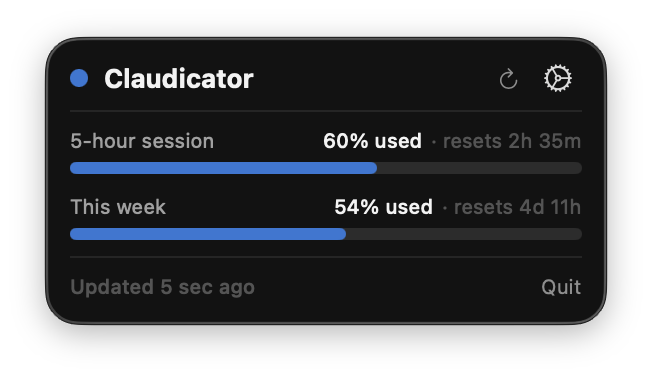

<div align="center">

# 🧠 Claudicator

### Your Claude quota, always one glance away.

A lightweight macOS menu bar app that shows how much **Claude** quota you have left —
your 5‑hour session and your weekly limit — with a live countdown to the next reset.

<sub>Built with SwiftUI · macOS 13+ · No tracking · Runs entirely on your Mac</sub>

</div>

---

## ✨ What it does

| | |
|---|---|
| 🔵 **At-a-glance status** | A color‑coded dot — blue, amber, or red — tells you how much you have left without even opening the popover. |
| ⏳ **Live countdown** | See exactly when your 5‑hour session and weekly quota reset. |
| 🔄 **Auto‑refresh** | Updates quietly every 90 seconds. Hit refresh anytime for an instant check. |
| 🔐 **Private by design** | Signs in with the same secure flow as Claude Code. Your password never touches the app, and nothing leaves your Mac. |

---

## 📥 Install

### Option 1 — Download the DMG

1. Grab the latest **`Claudicator.dmg`** from the [Releases page](../../releases).
2. Open it and drag **Claudicator** onto the **Applications** folder.
3. **First launch only:** because Claudicator isn't signed with a paid Apple
   Developer certificate, macOS will block it the first time with an
   *“Apple could not verify…”* message. To approve it:
   - Open **System Settings → Privacy & Security**, scroll down, and click
     **Open Anyway** next to Claudicator — then confirm.
   - (You only do this once. Updates and future launches open normally.)

> 🔒 Prefer not to trust a binary? Claudicator is fully open source — you can
> read the code and [build your own copy](#-build-from-source) instead.

### Option 2 — Build from source

See [Build from source](#-build-from-source) below. A copy you build yourself is
signed to run locally and opens with no Gatekeeper prompt.

---

## 🚀 Getting started

### 1. Open the app
Claudicator lives in your **menu bar** (top‑right of the screen) — look for the 🧠 icon.
There's no Dock icon and no window to manage; click the menu bar icon to see your usage.

### 2. Connect your Claude account
The first time you open it, click **Connect to Claude…**, then:

1. **Open authorization page** — your browser opens to Claude's sign‑in.
2. **Approve access** — log in and confirm, just like signing into Claude Code.
3. **Paste the code** — copy the code Claude shows you, paste it back into Claudicator, and click **Connect**.

That's it. 🎉 Your quota appears immediately and stays up to date.

> 💡 **macOS Keychain prompt:** macOS asks permission for Claudicator to use its
> secure storage (where your login is kept) — click **Always Allow** and enter your
> Mac password. Because Claudicator isn't signed with a paid Apple Developer
> certificate, macOS asks again after each **app update**. That's expected and
> safe — just click **Always Allow** each time. (Signing the app with a paid Apple
> Developer certificate would remove this prompt for good.)

---

## 📊 Reading the numbers

<div align="center">

</div>

Click the menu bar icon to open the popover:

- **Status dot + title** — the dot mirrors your session color (see below). **↻** refreshes
  right now; **⚙** opens account, plan, and update options.
- **5-hour session / This week** — each row shows the **percent used**, a progress bar,
  and a live **countdown** to its next reset.
- **Footer** — when the data last refreshed, plus **Quit**.

**The colors** (progress bar + status dot):

| Color | Meaning |
|:---:|---|
| 🔵 Blue | Plenty left (under 80% used) |
| 🟠 Amber | Getting low (80–90% used) |
| 🔴 Red | Almost out (over 90% used) |

---

## ❓ Troubleshooting

**“Not connected” or it asks me to connect again**
Your session may have expired. Just click **Connect to Claude…** and run through the
three steps again.

**Numbers look stuck**
Click the **↺ refresh** button in the popover for an instant update.

---

## 🛠 Build from source

Requirements: **Xcode 15+** on **macOS 13+**.

```bash
git clone https://github.com/<your-username>/claudicator.git
cd claudicator

# Build a Release .app and package it as Claudicator.dmg
./build-dmg.sh
```

Or open `Claudicator.xcodeproj` in Xcode and press **⌘R** to build and run.

A locally built copy is ad-hoc signed, so it launches without the Gatekeeper
prompt described above.

---

## 🔐 Privacy

Claudicator runs entirely on your Mac. It reads the OAuth token that Claude Code
stores in your macOS **Keychain** and uses it to call Anthropic's usage endpoint
(`api.anthropic.com`) directly. Your token is **never** sent anywhere else, and
there is no analytics, telemetry, or third-party server involved. The source is
right here for you to verify.

---

## 📄 License

[MIT](LICENSE) © Ari Ross

---

<div align="center">
<sub>Claudicator reads your usage from Claude's own quota service. It is an independent tool and is not affiliated with Anthropic.</sub>
</div>
